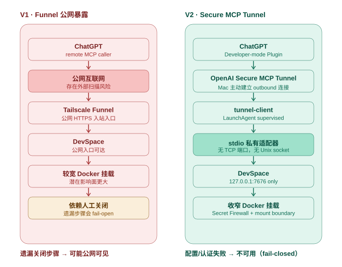

# ADR-0001：DevSpace 从公网 Funnel 迁移到私有 Secure MCP Tunnel

- 状态：Accepted
- 日期：2026-09-08
- 决策范围：ChatGPT / MCP 访问本机 DevSpace 的连接方式、安全边界和运行模型

## 背景

WebMCP Bridge 需要让浏览器中的 AI 能调用 DevSpace 提供的开发工具，同时不能把本机开发环境、凭据或宿主机能力无约束地暴露出去。

最初为了让 ChatGPT 能访问 DevSpace，采用了 Tailscale Funnel：把 DevSpace MCP 入口通过公网 HTTPS 暴露出去，使用结束后再手工关闭 Funnel。

2026-09-07 的实际运行暴露了这个模型的问题：Funnel 曾经约一天没有关闭，DevSpace 日志中出现 1,732 个 HTTP 请求，其中 33 个请求在扫描凭据或配置文件路径；公网暴露后约 65 秒即出现第一批扫描流量。

这说明问题不是“提醒用户记得关闭”即可解决，而是架构本身存在 fail-open 的人工步骤：一旦遗漏操作，系统会继续保持公网可达。

## V1：Tailscale Funnel 公网方案

逻辑链路：

```text
ChatGPT
   ↓
Public Internet
   ↓
Tailscale Funnel / public HTTPS endpoint
   ↓
DevSpace MCP
   ↓
Docker sandbox
   ↓
project files
```

### V1 的优点

- 实现直接，外部 MCP 客户端能访问标准 HTTPS endpoint。
- DevSpace 原生 OAuth 流程可以通过公网 URL 完成。

### V1 被放弃的原因

1. **存在公网入站入口。** DevSpace 的能力面包含文件读写、编辑和 shell，暴露面过高。
2. **安全依赖人工关闭。** 忘记关闭 Funnel 会把“临时暴露”变成“持续暴露”。
3. **失败方向错误。** 人为遗漏会导致公网可见，而不是不可用。
4. **本机数据边界过宽。** 当时的 Docker 挂载范围也比当前方案更宽，扩大了潜在影响面。
5. **公网 OAuth 并不是业务必需。** 后续验证表明 DevSpace OAuth 完全可以在 loopback 内完成。

## 决策

采用 V2：**OpenAI Secure MCP Tunnel + tunnel-client + stdio private adapter + loopback-only DevSpace**。

当前正式链路：

```text
ChatGPT
   ↓
OpenAI Secure MCP Tunnel
   ↑  Mac 主动建立 outbound HTTPS
   │
tunnel-client
   │  stdin/stdout
a private stdio adapter
   │  HTTP loopback + bearer token
   ↓
DevSpace 127.0.0.1:7676
   ↓
Docker sandbox
   ↓
/work/<approved project root>
```

V2 的核心目标不是“更安全地暴露 DevSpace”，而是：**正常运行时根本不存在需要暴露给公网的 DevSpace 入站端点。**

> 实现过程中 V2 曾短暂使用 `127.0.0.1:8787` 的 loopback HTTP adapter。进一步审查后认为 loopback 只限制网络范围，不等于调用方身份，因此最终改为 stdio：adapter 由 `tunnel-client` 作为子进程启动，不再拥有 TCP 端口或 Unix socket 地址。

架构对比图：



## V2 的工作原理

### 1. 连接方向：由公网入站改成 Mac 主动外连

`tunnel-client` 在 Mac 上主动连接 OpenAI 托管的 Tunnel 控制面。外部没有直接连接 DevSpace 的地址，也没有 Tailscale Funnel。

正常状态要求：

- `tailscale funnel status` 为 `No serve config`；
- adapter 没有 `8787` TCP listener；
- DevSpace 只发布 `127.0.0.1:7676`。

因此网络层的默认状态是“不可从公网直接到达”。

### 2. stdio adapter：移除本机可连接地址

`tunnel-client` 通过 stdin/stdout 启动 adapter 子进程，并直接交换 JSON-RPC。

这比 loopback HTTP 更强：

- loopback HTTP 仍然有一个本机地址，其他本机进程理论上可以尝试连接；
- Unix socket 依赖文件权限；
- stdio 没有独立监听地址，只有启动该子进程并持有 runtime 凭据的 `tunnel-client` 能与它通信。

stdout 只承载 JSON-RPC；诊断日志走 stderr，避免破坏 MCP framing。

### 3. DevSpace OAuth 全部留在 loopback

DevSpace 1.0.8 的 `/mcp` 强制 bearer authentication，因此 adapter 不能简单绕过 OAuth。

V2 不把 OAuth 暴露给 ChatGPT，而是由 adapter 在本机完成：

1. adapter 从 DevSpace loopback endpoint 读取 OAuth metadata；
2. adapter 把 metadata 中的 endpoint host 改写回配置的 loopback upstream，只保留路径；
3. adapter 在本机向 `/authorize` 提交 owner token；
4. adapter 完成 PKCE / token exchange；
5. 拿到的 access token 只存在 adapter 进程内；
6. adapter 带 bearer token 调用 `127.0.0.1:7676/mcp`。

adapter 对 Tunnel **不发布** OAuth metadata；`/.well-known/*`、`/authorize`、`/token` 不成为远程调用路径。这样 Tunnel 保持在 unauthenticated-target / No Auth 模式，远端不会被引导去访问本机 OAuth URL。

### 4. MCP 兼容层吸收 ChatGPT / DevSpace 协议差异

当前 adapter 还承担一层最小 MCP compatibility：

- 对 ChatGPT / tunnel-client 的 `server/discover` 探测返回与原 request id 对应的 `-32601 Method not found`，使调用方在同一进程内降级到 legacy initialize 流程；
- `initialize` 永远不复用旧 `mcp-session-id`，避免第二次初始化被旧 session 污染；
- 如果 stdio adapter 重启后 connector 直接发 `tools/list` / `tools/call`，adapter 可以先合成：

```text
initialize
→ notifications/initialized
→ original request
```

以恢复 adapter 侧丢失的 legacy MCP session；
- JSON-RPC 数字 `error.code` 会被保留，而 OAuth authorization code 仍会被脱敏。

这些兼容逻辑只解决已观察到的真实协议差异，不把 adapter 扩张成一个完整 MCP server 实现。

### 5. Secret Firewall 在请求前和响应后各执行一次边界控制

请求方向：

```text
remote tool request
   ↓
tool allowlist
   ↓
path extraction / path policy
   ↓
allowed request only
   ↓
DevSpace
```

当前只允许审查过的 DevSpace 工具：

- `open_workspace`
- `read`
- `write`
- `edit`
- `bash`

能明确识别路径的请求会在 DevSpace 读取文件**之前**做 deny 检查；敏感路径被拒绝时，内容根本不会进入 DevSpace tool result。

响应方向：

```text
DevSpace result
   ↓
auth metadata scrubbing
   ↓
Secret Firewall content policy
   ↓
redacted / approved JSON-RPC
   ↓
stdio
   ↓
Tunnel / ChatGPT
```

无法分类、无法解析、超限或策略执行失败的结果不会原样透传。

### 6. Docker 是第二层数据边界

Secret Firewall 不是唯一防线。DevSpace container 本身只看到批准的项目根。

当前默认挂载收窄到：

```text
~/Doc/My code  →  /work/My code
```

而不是整个 `~/Doc`。`Backups`、DevSpace 管理目录等不应出现在容器内；检测到的敏感凭据文件使用只读空文件覆盖。

特别是 `bash.command` 属于 shell 文本，不能靠结构化 path 参数穷尽所有可能路径表达，因此 Docker mount boundary 是不可替代的控制层。

### 7. publicBaseUrl 被固定回 loopback

DevSpace 会把 `publicBaseUrl` 持久化在 `devspace-config` volume。仅删除旧的环境变量不足以消除 Funnel 时代留下的公网 URL。

启动流程因此会把它规范化为：

```text
http://127.0.0.1:7676
```

这同时确保 OAuth resource validation 与当前私有链路一致。

### 8. fail-closed 是最终原则

V1 的危险点是：忘记关闭 → 公网仍然可见。

V2 的目标是：配置缺失、token 错误、body 超限、未知工具、无法解析的响应、Secret Firewall 失败等情况都应当导致请求失败，而不是降低安全要求继续执行。

即：

```text
安全状态优先于可用状态
```

## 结果与验证

V2 在 2026-09-08 已完成真实环境验证：

- ChatGPT Developer-mode Plugin 能通过现有 Tunnel 调用 DevSpace；
- `npm run check`：156/156 tests passed；
- LaunchAgent：`ready=true`；
- Tailscale Funnel：`No serve config`；
- adapter：无 `8787` listener；
- DevSpace：仅 `127.0.0.1:7676`；
- ChatGPT 已完成真实只读 DevSpace tool call。

详细迁移验证材料曾记录在 retired adapter/eval 文档中；这些已从 active tree 删除，仍可通过 Git 历史查阅。

## 已知限制

当前 synthetic session restore 解决的是 **adapter 自己重启后内存中的 session 丢失**。

如果 adapter 仍然存活，但 DevSpace 重启并丢失 MCP session state，adapter 可能继续持有 stale `sessionId`。当前 patch 没有实现自动 stale-session recovery，因为还没有确认真实 DevSpace 对 invalid/stale session 的精确信号。

后续如果处理此问题，应先对真实 DevSpace 做 probe，确定可靠的 invalid-session response，再设计 bounded invalidate + reinitialize + single retry；不应把普通 400/401 粗暴地当成 session 失效。

## 后果

### 正面

- 正常运行时没有 DevSpace 公网入站 endpoint；
- 移除了“记得关 Funnel”这一人工安全步骤；
- adapter 自身没有监听地址；
- OAuth 凭据和 DevSpace token 留在本机；
- 网络、adapter policy、Secret Firewall、Docker mount 形成多层边界；
- 失败方向从“暴露”改为“不可用”。

### 代价

- 多了一层 adapter 和 tunnel runtime，需要维护协议兼容；
- DevSpace OAuth / MCP session 生命周期需要在 adapter 内做最小适配；
- Tunnel runtime 与本机 LaunchAgent 成为新的运行依赖；
- 某些 DevSpace session failure mode 仍需未来补充真实环境验证。

## 不再允许的回退

除非新增 ADR 明确推翻本决策，否则以下做法不应重新成为正常路径：

- 使用 Tailscale Funnel 暴露 DevSpace MCP；
- 让 DevSpace 绑定公开接口作为 ChatGPT 的常规入口；
- 把 adapter 恢复成无认证的 loopback HTTP listener；
- 为方便而扩大 Docker mount 到整个 home 或整个 `~/Doc`；
- 将 DevSpace owner token、Tunnel runtime key 或 access token 明文写入 tracked config；
- 安全失败时退化为绕过 Secret Firewall 或直接透传 raw tool result。
